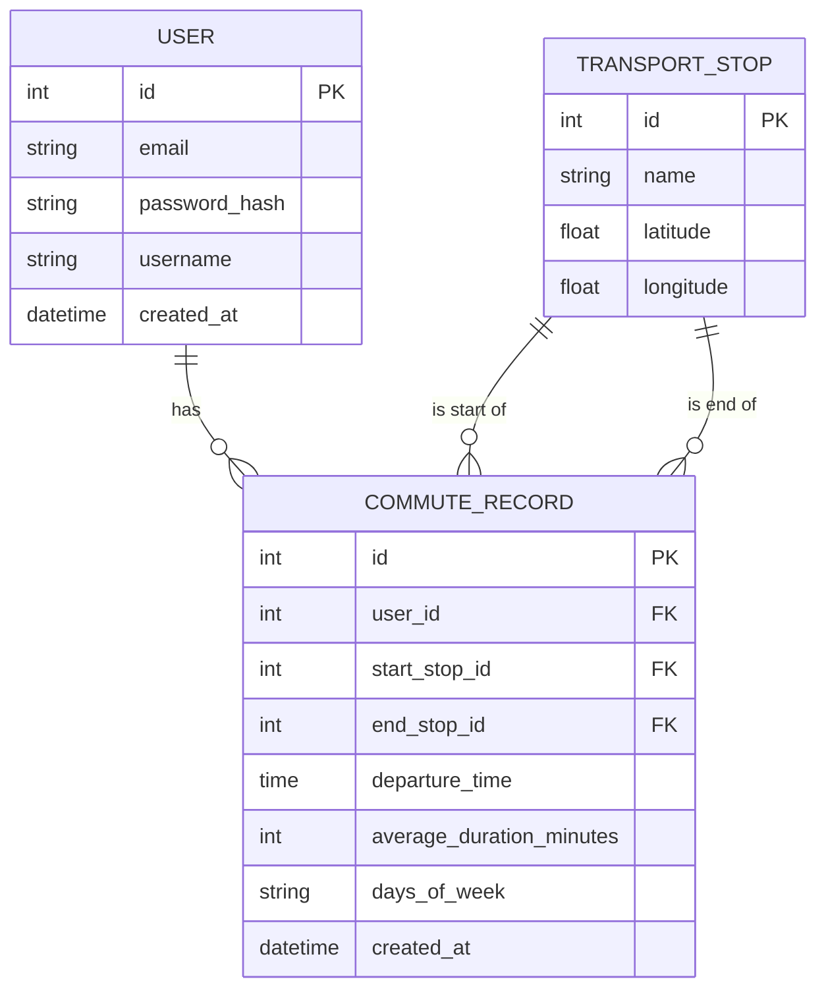

# 🚇 Commute Calculator

## 📝 Le contexte du projet
Une application web conçue pour aider les utilisateurs à calculer et suivre leurs temps de trajet quotidiens en transport en commun. Ce projet a été développé dans le cadre du programme de la Wild Code School (v7.1.7) suivant l'architecture React-Express-MySQL. Ce projet est désigné pour être une petite présentation pour le Checkpoint 4, qui est un résumé de l'ensemble des technologies étudiées durant le programme de la formation Bootcamp JS (4 mois).

## ✨ Fonctionnalités développées

### 🔐 Authentification
- Inscription utilisateur avec validation
- Connexion/déconnexion sécurisée avec JWT
- Gestion de profil utilisateur avec avatar
- Routes protégées et persistance de session

### 📍 Gestion des Transports
- Visualisation des arrêts disponibles
- Sélection des points de départ et d'arrivée
- Validation des arrêts différents
- Gestion des états de chargement

### ⏱ Suivi des Trajets
- Calcul automatique de la durée des trajets
- Sélection de date et heure de départ
- Historique des déplacements
- Partage de trajets

### 📊 Statistiques Personnelles
- Vue détaillée du dernier trajet calculé
- Statistiques globales (temps total, trajets fréquents)
- Analyses détaillées (quotidien, hebdomadaire, mensuel)
- Possibilité de supprimer l'historique

## 🛠 Les technos utilisées
- **En Front :**
  - React avec TypeScript
  - Vite pour le build
  - React Router DOM pour la navigation
  - Context API pour la gestion des states
  - Framer Motion pour les animations
  - LocalStorage pour la persistance de certaines données

- **Du côté Back :**
  - Node.js avec Express
  - MySQL pour la base de données
  - JWT pour l'authentification
  - Multer pour la gestion des fichiers
  - Bcrypt pour le hachage des mots de passe

## 📊 Database Model

## 🚀 Guide d'installation

### Prérequis
- Node.js
- MySQL
- Git

### Les étapes à suivre

1. Clone the repository
```bash
git clone <your-repository-url>
cd commute-project
```

2. Installation des dépendences
```bash
# en Front
cd client
npm install

# en Back
cd ../server
npm install
```

3. Configuration des variables d'environnement
```bash
# en Front
cd client
cp .env.example .env

# en Back
cd ../server
cp .env.example .env
```

4. Set up de la base de données
```bash
mysql -u root -p < server/database/schema.sql
```

## 🎯 Faire (enfin) tourner l'application !

### En mode dev

1. Démarrer le serveur en back
```bash
cd server
npm run dev
```

2. Démarrer le serveur en front
```bash
cd client
npm run dev
```

## 🤝 Contribution
Les contributions sont les bienvenues ! N'hésitez pas et merci d'avoir pris le temps de tester mon petit projet.