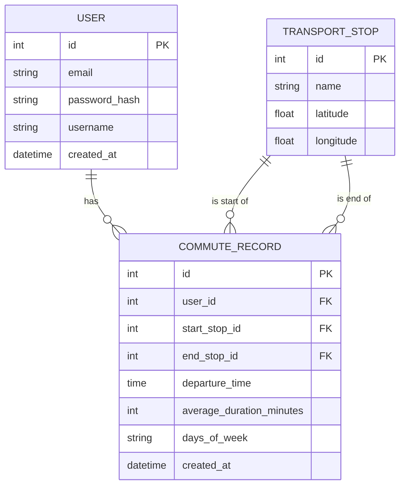

# 🚇 Commute Calculator

## 📝 Le contexte du projet
A web application designed to help users calculate and track their daily commute times using public transportation. This project was developed as part of the Wild Code School curriculum (v7.1.7) following the React-Express-MySQL architecture.

## ✨ Fonctionnalités développées

### 🔐 Authentification
- Inscription utilisateur
- Connexion/déconnexion sécurisée
- Routes protégées

### 📍 Gestion des Transports
- Visualisation des arrêts disponibles
- Sélection des points de départ et d'arrivée
- Calcul des distances entre les arrêts

### ⏱ Suivi des Trajets
- Calcul de la durée des trajets
- Statistiques quotidiennes
- Historique des déplacements

### 📊 Statistiques Personnelles
- Historique complet des trajets
- Durée moyenne des déplacements
- Itinéraires les plus fréquents

## 🛠 Les technos utilisées
- **En Front :**
  - React
  - TypeScript
  - Vite
  - React Router DOM
  - Context API

- **Du côté Back :**
  - Node.js
  - Express
  - MySQL
  - JSON Web Token (JWT)

## 📊 Database Model

## 🚀 Guide d'installation

### Prérequis
- Node.js
- MySQL
- Git

### Les étapes à suivre

1. Clone the repository
```bash
git clone <your-repository-url>
cd commute-project
```

2. Installation des dépendences
```bash
# en Front
cd client
npm install

# en Back
cd ../server
npm install
```

3. Configuration des variables d'environnement
```bash
# en Front
cd client
cp .env.example .env

# en Back
cd ../server
cp .env.example .env
```

4. Set up de la base de données
```bash
mysql -u root -p < server/database/schema.sql
```

## 🎯 Faire (enfin) tourner l'application !

### En mode dev

1. Démarrer le serveur en back
```bash
cd server
npm run dev
```

2. Démarrer le serveur en front
```bash
cd client
npm run dev
```

## 🤝 Contribution
Les contributions sont les bienvenues ! N'hésitez pas et merci d'avoir pris le temps de tester mon petit projet.